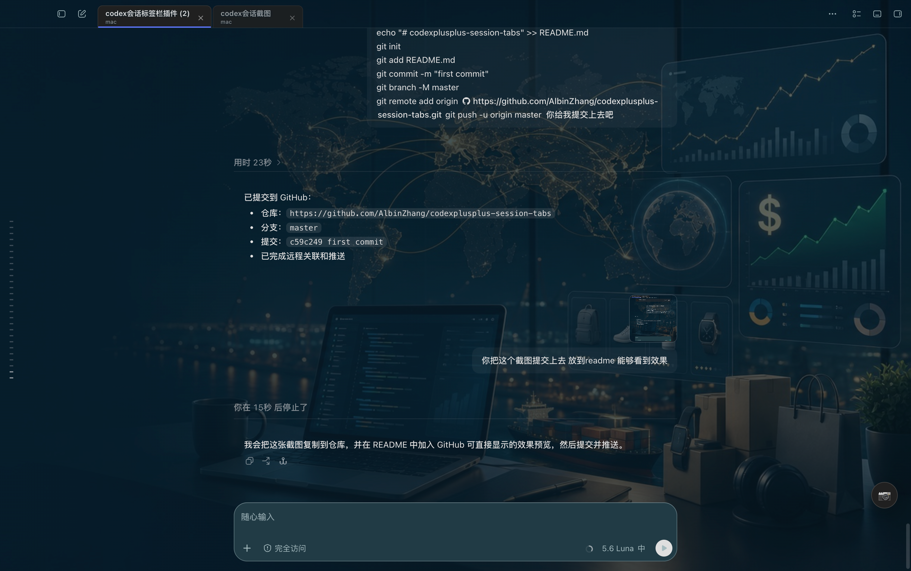

# Codex++ 会话标签栏

Codex++ 本地脚本，为 Codex 顶部添加可拖动的 Chrome 风格会话标签。

## 依赖

本脚本依赖 **Codex++ 管理工具**的本地脚本环境运行，不支持脱离 Codex++ 直接安装到 Codex。

Codex++ 脚本市场：<https://github.com/BigPizzaV3/CodexPlusPlusScriptMarket>

## 效果预览



## 功能

- 自动把打开过的会话加入标签栏
- 显示会话标题和项目名称
- 点击标签切换会话
- 支持拖动调整标签顺序
- 支持从标签栏移除标签，不删除会话
- 显示待读蓝点和进行中旋转状态
- 侧边栏收起时仍可切换已缓存的会话
- 切换会话后自动重新挂载，避免标签栏消失

## 安装

1. 将 `codex-tabs.js` 复制到：

   ```text
   ~/.config/Codex++/user_scripts/
   ```

2. 打开 Codex++ 管理工具。
3. 进入“脚本市场”中的“本地脚本”。
4. 刷新脚本列表并启用 `codex-tabs.js`。
5. 重启 Codex++，或使用本地脚本重载功能。

## 数据存储

标签顺序保存在当前 Codex 页面自己的 `localStorage` 中，键名为：

```text
codex-plus.chrome-tabs.v1
```

## 兼容性说明

脚本依赖 Codex 当前页面的 DOM 属性和 React 会话点击处理器。Codex 页面结构更新后，可能需要调整选择器或重新验证切换逻辑。

## 文件

- `codex-tabs.js`：主脚本
